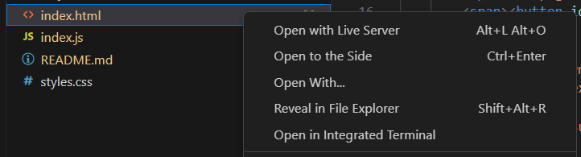
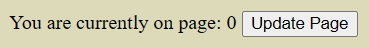
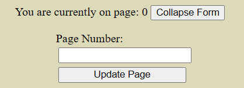
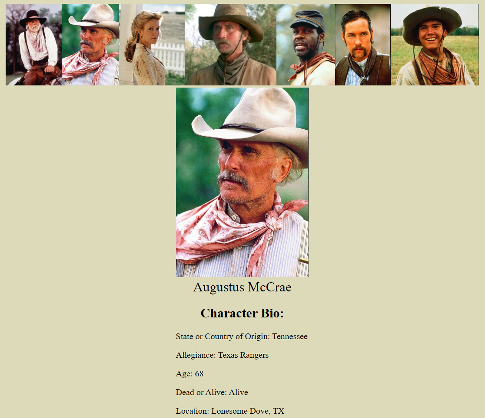
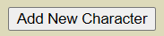
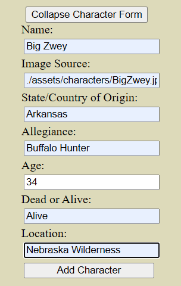

# The Hat Creek Cattle Co. Character DB

The Hat Creek Cattle Co. Character DB is an interactive web database of characters from Larry McMurtry's 1985 Pulitzer Prize winning novel, _Lonesome Dove_. The webpage allows users reading the novel to keep track of the characters introduced throughout the story as they read, maintaining a quick and easy way for them to update characters' status, location, and other details as the story progresses. Users can add new character profiles as the story progresses and introduces the many colorful people inhabiting McMurtry's vision of the American West at the height of the cattle-drive era.

## Installation

Fork and clone this repo from its main gitHub branch onto your machine and access it via your text-editor of choice. json-server and the Live Server extensions are required for running the local character database and web-app front end, respectively.

Execute command: 'json-server --watch db.json' in your terminal to initiate the local json-server hosting the web-app's database.

````bash
json-server --watch db.json
````
Open file "index.html" using the Live-Server extension in your text-editor of choice to begin running the web-app out of your browser.



## Usage

Click on the "Update Page #" button to access the page-number-entry form.




Enter your current page number for keeping track of your progress and click "Update Page" to save your page number.




Click on a character's image in the character selection window to view their bio details.




Click on the "Add New Character" button at the bottom of the page to access the character-entry form.



Enter your new character details into the form and click "Add Character" to update your DB (and webpage view) with the new character, who will now be visible in the character selection window.



Because The Hat Creek Cattle Co. Character DB json-server hosted db.json file is updated with your input data every time you submit a new character or change your page number, you don't have to worry about losing your progress when you close out of the application! Just start the json-server for the db.json and live-server for the html file to pick up right where you left off!

Happy trails!

## Contributing.

Pull requests are welcome. For major changes, please open an issue first to discuss what you would like to change.

## Roadmap

Future versions of The Hat Creek Cattle Co. Character DB will be developed to include:
- A character edit feature for existing characters
- A delete character feature
- A user-notes section for each character
- Updated styling
- A dynamic "Current Chapter" field similar to the Page # feature
- Far down the road: the ability for your Character Bio Profiles to be saved to the chapter you're on and then for historical bios to be re-accessible automatically when you navigate to a specific chapter again. In other words, Character Bio Profiles will be sensitive to book progress.